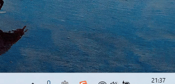

<div align="center">

# 🔔 Claude Code Notify

[](README.md)

**Claude Code 原生 Windows Toast 通知**




*点击通知即可跳转回 Claude Code 窗口*

</div>

---

## ✨ 特性

- 🔔 **原生 Toast 通知** — 干净、系统级的通知体验
- 🎯 **一键返回** — 点击通知跳转回终端/编辑器
- 🖥️ **广泛兼容** — 支持 VSCode、Cursor、JetBrains、Windows Terminal 等
- 🔄 **标签页感知** — 支持 Windows Terminal 标签页精确切换
- 🎨 **自动图标** — 自动提取调用应用的图标

---

## 🚀 安装

```bash
claude plugin marketplace add chuilishi/claude-code-notify
claude plugin install claude-code-notify@claude-code-notify
```

就这样。重启 Claude Code 即可自动生效。

---

## 📖 使用方法

Claude 回答结束后，右下角弹出通知：

| 操作 | 效果 |
|------|------|
| **左键点击** | 跳转回 Claude Code 窗口 |
| **右键点击** / **点击 ×** | 关闭通知 |

---

## 🗑️ 卸载

```bash
claude plugin uninstall claude-code-notify
```

---

<details>
<summary><b>⚙️ 工作原理</b></summary>

<br>

本项目使用 Claude Code 的**插件系统**自动注册 hooks，无需手动编辑 `settings.json`。

| Hook | 触发时机 | 动作 |
|------|---------|------|
| `UserPromptSubmit` | 发送消息时 | 保存当前窗口状态 |
| `Stop` | Claude 完成时 | 显示"任务完成"通知 |
| `Notification` | Claude 需要输入时 | 显示"需要输入"通知 |
| *点击通知* | — | 激活保存的窗口 |

</details>

---

<div align="center">

MIT License

</div>
